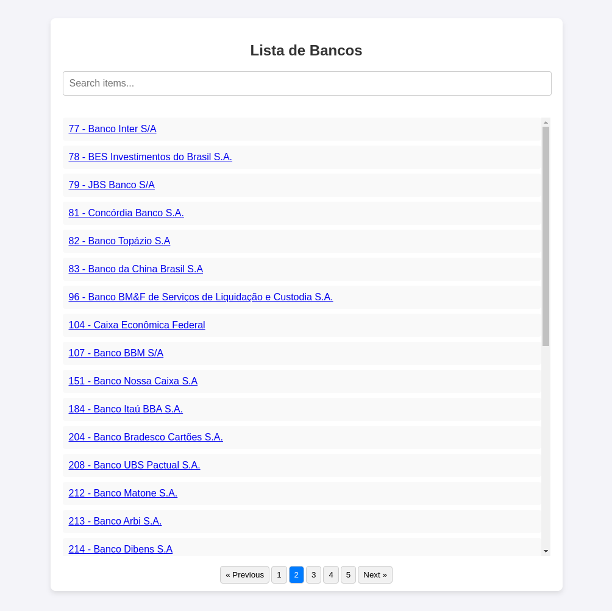

<h1 align="center">Banks Listing</h1>

<p align="center">


</p>


**Banks Listing** é uma aplicação web de teste projetada para fornecer uma maneira rápida de visualizar e buscar instituições financeiras. Através de sua interface simples, a aplicação exibe uma listagem paginada de bancos, permitindo aos usuários encontrar facilmente as instituições que estão procurando, com uma busca dinâmica que filtra os resultados em tempo real. A API conta com duas rotas principais que garantem uma boa navegação: a primeira, para obter a lista completa de bancos com paginação, e a segunda, para acessar informações detalhadas sobre qualquer banco específico.

<div align="center">
    
</div>

## Requisitos
- [Docker](https://docs.docker.com/engine/install/)
- [Docker Compose Plugin](https://docs.docker.com/compose/install/)


## Rodando localmente

Faça um clone do repositório localmente.

```bash
  git clone https://github.com/philipe-vieira/banks-listing; cd banks-listing
```

Faça uma cópia do arquivo `.env.example` para o `.env`, e configure as variáveis de ambiente conforme sua preferência.

```bash
  cp .env.example .env
```

Para executar esta aplicação localmente faça uma cópia do arquivo `.env.example` para `.env`, configure as variáveis de ambiente conforme sua preferência e use o comando abaixo para subir a aplicação

```bash
  docker compose -f docker-compose.yml up -d --build
```

## Rodando os testes

Após executar a aplicação é possivel rodar os teste utilizando o seguinte comando

```bash
  docker exec app bash -c "php artisan test"
```

## Documentação da API

#### Retorna todos os bancos

```http
  GET /api/bancos
```

| Parâmetro   | Tipo       | Descrição                           |
| :---------- | :--------- | :---------------------------------- |
| `perPage` | `int` | **Opcional**. A quantidade de itens em cada página da paginação |
| `page` | `ibt` | **Opcional**. A página de itens desejada |

#### Retorna um banco específico

```http
  GET /api/banco/${id}
```

| Parâmetro   | Tipo       | Descrição                                   |
| :---------- | :--------- | :------------------------------------------ |
| `codigo`    | `int` | **Obrigatório**. O ID do banco desejado |

## Tecnologias Utilizadas


## Licença

Este projeto é open-source sob licença [MIT license](https://spdx.org/licenses/MIT.html).
